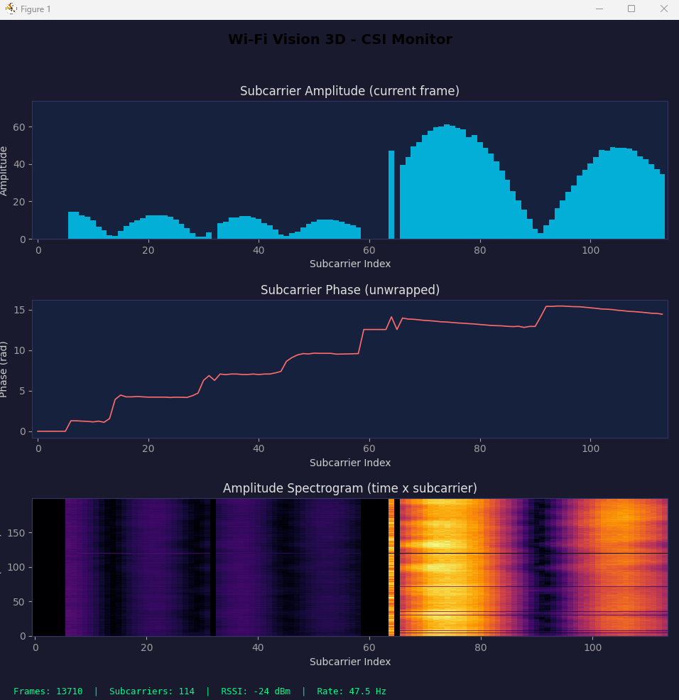

# wifi-csi-capture

Firmware and tools for extracting Wi-Fi Channel State Information (CSI) from ESP32-S3 microcontrollers. Captures amplitude and phase data across 114 OFDM subcarriers (HT40, 40MHz) at **100 Hz** and exports it as structured CSV for downstream analysis, digital twin calibration, or AI training pipelines.

<p align="center">
  
</p>

<p align="center"><em>Real-time CSI visualizer showing subcarrier amplitude, unwrapped phase, and amplitude spectrogram at ~47 Hz</em></p>

## What is CSI?

Modern Wi-Fi (802.11n/ac/ax) uses Orthogonal Frequency-Division Multiplexing (OFDM), splitting the channel into many narrow subcarriers. CSI exposes the **amplitude and phase** of each subcarrier at the physical layer. When a person moves through the RF field, their body (mostly water) reflects and absorbs microwaves, altering the multipath propagation pattern. These perturbations are encoded in the CSI matrix and can be used to detect presence, movement, and even body pose -- all without cameras.

## Architecture

```
  Dedicated Router          ESP32-S3 nodes             PC
  ┌──────────────┐       ┌────────────────┐       ┌──────────────┐
  │  2.4GHz Tx    │~WiFi~>│  CSI Extraction │~USB~>│  Capture &    │
  │  802.11n HT40 │       │  114 subcarriers│       │  Visualization│
  │  Fixed channel│<~ICMP~│  Queue → Serial │       │  CSV export   │
  └──────────────┘       └────────────────┘       └──────────────┘
```

**Firmware design**: The CSI callback runs in the Wi-Fi task context and enqueues formatted lines into a FreeRTOS queue (zero-copy from callback perspective). A dedicated output task drains the queue to serial, preventing any I/O blocking in the Wi-Fi stack. An ICMP ping session generates continuous traffic to the router, which responds with Echo Reply frames that trigger CSI extraction at up to 100 Hz.

## Hardware requirements

- **ESP32-S3 dev board** (x2 minimum, up to 8) -- any board with USB serial
- **Dedicated Wi-Fi router** -- configured for 2.4GHz only, 802.11n, 40MHz bandwidth, fixed channel. Must be isolated (no internet needed).
- **USB cables** -- one per ESP32-S3, for power and data

## Software requirements

- [ESP-IDF v5.5+](https://docs.espressif.com/projects/esp-idf/en/v5.5.3/esp32s3/get-started/index.html)
- Python 3.11+
- Dependencies: `pip install -r tools/requirements.txt`

## Quick start

### 1. Configure Wi-Fi credentials

```bash
idf.py menuconfig
# Navigate to: CSI Capture Configuration
#   → WiFi SSID:     your_router_ssid
#   → WiFi Password:  your_router_password
#   → WiFi Channel:   6  (must match router)
```

### 2. Build and flash

```bash
idf.py build
idf.py -p COM3 flash
```

### 3. Verify with serial diagnostic

```bash
pip install -r tools/requirements.txt
python tools/diagnose_serial.py --port COM3 --duration 15
```

You should see output like:

```
Tasa CSI:          100.3 Hz
Subportadoras:     114 (promedio)
Frames HT:         100%
```

### 4. Real-time visualization

```bash
python tools/visualize_csi.py --port COM3
```

This opens a live window with three panels: subcarrier amplitude, unwrapped phase, and amplitude spectrogram.

### 5. Capture data to CSV

```bash
python tools/capture_csi.py --port1 COM3 --port2 COM4 --position 1 --duration 300
```

Data is saved to the `data/` directory (gitignored).

## Project structure

```
├── CMakeLists.txt                  ESP-IDF project root
├── sdkconfig.defaults              Default config (CSI, 921600 baud, PS off)
├── main/
│   ├── CMakeLists.txt              Component dependencies
│   ├── csi_capture_main.c          Firmware: WiFi + CSI + ICMP ping + Queue
│   └── Kconfig.projbuild           Configurable SSID, password, channel
├── tools/
│   ├── requirements.txt            Python dependencies (pyserial, matplotlib, numpy)
│   ├── capture_csi.py              Serial capture to CSV (1-2 nodes, threaded)
│   ├── visualize_csi.py            Real-time amplitude, phase, spectrogram plots
│   ├── diagnose_serial.py          Serial diagnostics (auto baud, CSI rate, sig_mode stats)
│   ├── measurement_protocol.py     4-round sequential capture across 8 positions
│   ├── analyze_csi.py              Statistics, empty-vs-person comparison, baseline export
│   └── digital_twin_sionna.py      Scene config for NVIDIA Sionna ray tracing
```

## CSI output format

Each line from the ESP32-S3 serial port:

```
CSI_DATA,<timestamp_us>,<mac>,<rssi>,<rate>,<sig_mode>,<mcs>,<cwb>,<smoothing>,
  <not_sounding>,<aggregation>,<stbc>,<fec>,<sgi>,<channel>,<secondary_ch>,
  <rx_seq>,<len>,<first_word_invalid>,<imag0>,<real0>,<imag1>,<real1>,...
```

In HT40 mode: 114 subcarriers = 228 int8 values (imaginary, real pairs).

## Key configuration

All Wi-Fi settings are configurable via `idf.py menuconfig` (stored in `sdkconfig`, which is gitignored). The file `sdkconfig.defaults` contains safe defaults:

| Setting | Default | Purpose |
|---------|---------|---------|
| `CONFIG_ESP_WIFI_CSI_ENABLED` | `y` | Enable CSI subsystem |
| `CONFIG_ESP_CONSOLE_UART_BAUDRATE` | `921600` | High baud rate for CSI throughput |
| `CONFIG_FREERTOS_HZ` | `1000` | 1ms tick resolution for precise ping timing |
| `CONFIG_LOG_DEFAULT_LEVEL` | `3` (INFO) | Show status reports during capture |

The firmware also applies at runtime: `WIFI_PS_NONE` (radio always on), promiscuous mode (all frames), and `uart_set_baudrate(921600)` to override any sdkconfig defaults.

## Performance

| Metric | Value |
|--------|-------|
| Internal CSI rate | **100 Hz** |
| Serial throughput | **~50-93 Hz** (depending on line length) |
| Subcarriers per frame | **114** (HT40) |
| Queue drops | **0** (32-slot buffer) |
| Free heap at runtime | **~212 KB** |

## License

MIT
